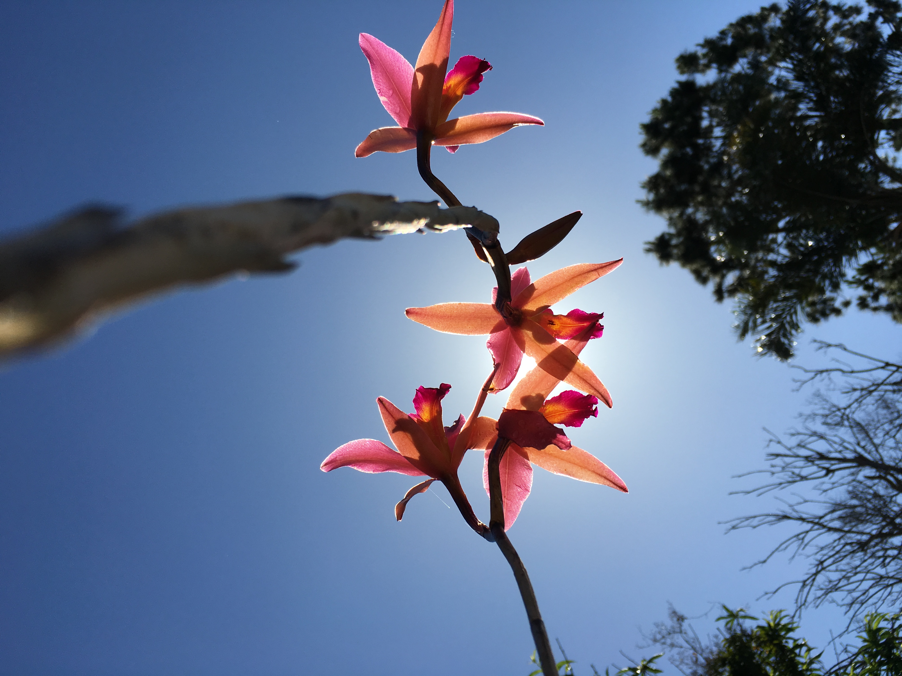
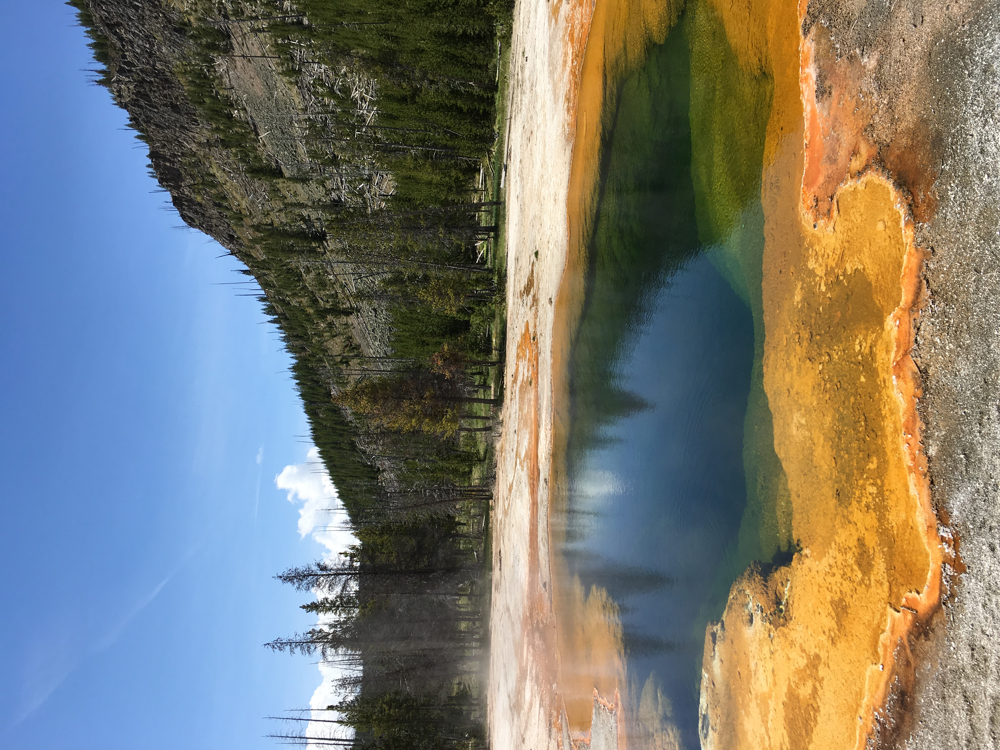

<!DOCTYPE html>
<html lang="en">
  <head>
    <meta charset="UTF-8" />
    <meta name="viewport" content="width=device-width, initial-scale=1.0" />
    <meta http-equiv="X-UA-Compatible" content="ie=edge" />
    <title>Document</title>
    <link rel="stylesheet" href="index.css" />
  </head>
  <body>
    <header id="section1">
      <nav>
        
<a href="#section1">Brandon Lavinsky</a>

        <ul>
          <li><a href="#section2">About</a></li>
          <li><a href="#section3">Projects</a></li>
          <li><a href="#section4">Photos</a></li>
          <li><a href="#section5">Contact</a></li>
        </ul>
      </nav>
      

        <h1 class="me">
          Hello my name is<strong class="b"> Brandon Lavinsky</strong>
        </h1>
        <h3 class="me_sub">
          Welcome to my portfolio
        </h3>

        

          

            
          

          

            
          

          

            
          

        

        

      

    </header>
    <main >
      
      <section class="about">
        <h1 >About Me</h1>

        

          

            

              
            

            

              <h3>Brandon Lavinsky</h3>
              

                I'm a Software Engineer from Southern California with a passion
                for web development, photography, and anything and everything
                outdoors
              

            

          

          

            

              
            

            

              <h3>Chapman University</h3>
              
BS Software Engineering Minor in Analytics

            

          

          

            

              
            

            

              <h3>Hobbies</h3>
              
Surfing Photography Drawing Hiking

            

          

        

      </section>

      <section class="projects" id="section3">
        <h1>Projects</h1>

        

          

            

              

                <h2>Campaignify</h2>
                

                  
                

              

              

                Mobile voter canvassing tool developed for the mayor of Costa
                Mesa to aid in collecting relevant voter data in preparation for
                elections.
              

              
-React -Ruby -GraphQL -Docker

            

          

          

            

              

                <h2>Recipe Whiz</h2>
                

                  
                

              

              

                Android app created with the vision of eliminating the need for
                paper recipes.
              

              
-Android -Java

            

          

          

            

              

                <h2>Housing Helper</h2>
                

                  
                

              

              

                Command line interface tool developed to help student find
                housing for their college campus.
              

              
-Java -JDBC -MySQL

            

          

        

        

          <h3>Check out my Github for more projects!</h3>
          <a href="https://github.com/lavin105" download="Resume" class="to_git">https://github.com/lavin105</a>
        

      </section>

      <section class="photos" id="section4">
        <h1>Photography</h1>

        

          

            
          

          

            
          

          

            
          

        

      </section>

      <section class="contact" id="section5">

        <h1>Contact Me</h1>
        <h3>Email</h3>
        <h4>-brandonlavinsky@gmail.com</h4>
        <h4>-lavin105@mail.chapman.edu</h4>
        <h3>Phone</h3>
        <h4>-(310)-972-0622</h4>
        </h4> 
         

      </section>
    </main>
  </body>
</html>
